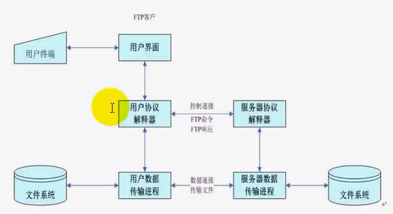
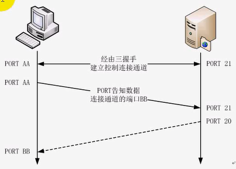
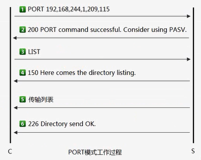
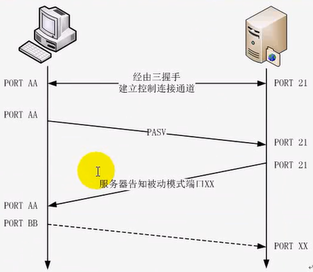
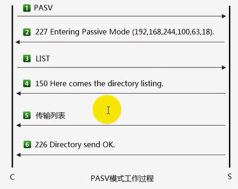
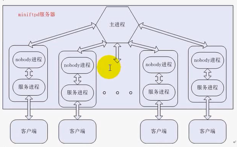
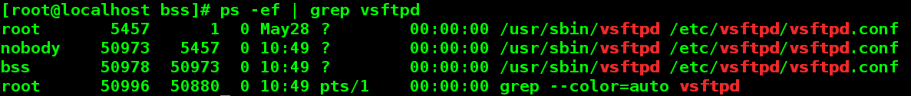

 <h1 align=center> OnLine_BigInt</h1>

### 一、项目分析
#### 1. 项目调研实现背景

有时我们需要一个文件服务器，用于大家的文件共享、上传、下载，并且可以达成不同平台之间的共享，比如Windows系统和Linux系统，因此我们需要实现一个服务，已满足于我们的共享需求，并配合于相应的客户端（leapftp）进行使用.

#### 2.ftp是什么
FTP就是文件传输协议。用于互联网双向传输，控制文件下载空间在服务器复制文件从本地计算机或本地上传文件复制到服务器上的空间。

#### 3.vsftpd的安装、配置、与演示
3.1 vsftpd的安装

​	   yum install vsftpd -y

3.2 vsftpd的配置

​       vim /etc/vsftpd/vsftpd.conf        基本保持默认配置就够使用，具体配置可以根据个人需要

3.3 vsftpd的启动、停止

​       systemctl start vsftpd      |        systemctl stop vsftpd

3.3 vsftpd的防火墙关闭

​       使用客户端连接ftp,有时会因为防火墙的缘故而导致连接不上，因此一般关闭防火墙

​       systemctl stop firewalld

3.4 Linux下的lftp演示

​       3.4.1 lftp的安装   ：yum install lftp -y

​       3.4.2 lftp连接ftp ：lftp 192.168.232.10

​       3.4.3 lfpt使用

```C
防火墙：
systemctl start   firewalld.service
systemctl stop    firewalld.service
systemctl restart firewalld.service

ftp:
service vsftpd start
service vsftpd restart
service vsftpd stop
lftp 192.168.0.50

lftp:
下载文件:
get <filename>
mirror <dirname>ls
    
lftp命令使用
lftp ftp://[用户名:密码@]<FQDN>|<IP地址> [:端口]
lftp ftp://<FQDN>|<IP 地址> -p port -u 用户名,密码
help:查看全部可操作的命令
ls : 显示FTP服务器文件列表
!ls: 显示本地文件列表
cd: 切换远端目录
!cd: 切换本地目录
get: 从FTP服务器下载单个文件到本地当前目录
mget: 从FTP服务器下载多个文件到本地当前目录
pget :使用多个线程来下载远端文件
put : 将单个文件上传到FTP服务器
mput :将多个文件上传到FTP服务器
mv :移动FTP服务器上的文件
rm: 删除FTP服务器上的文件 (使用参数 -r 递归删除)
mrm: 删除FTP服务器上的多个目录
mkdir :在FTP服务器上建立目录
pwd : 显示日前FTP服务器所有目录
lpwd: 显示本地目录
exit :退出ftp会话过程
 
发现没有权限创建文件或是目录，查找原因，原来是selinux引起的登陆问题。
为避免每次开机都要作这个操作，可在setsebool命令后面加上-P选项，使改动永久有效
getsebool -a | grep ftp
setsebool allow_ftpd_full_access on
sestatus -b| grep ftp
```

3.2 Windows下的leapftp演示


### 二、项目设计
#### 1.FTP工作原理



 ##### 1.1启动FTP
 >在客户端，通过交互的用户界面，客户从终端输入启动FTP的用户交互式命令

 ##### 1.2 建立控制连接

 >客户端TCP协议层根据用户命令给出的服务器IP地址，向服务器提供FTP服务的21端口（该端口是TCP协议层用  来传输FTP命令的端口）发出主动建立连接的请求，服务器收到请求后，通过3次握手，就在进行FTP命令处理的用户协议解释器进程和服务器协议解释器进程之间建立一条TCP连接

 ##### 1.3 建立数据连接

>当客户通过交互式的用户界面，向FTP服务器发出要下载服务器上某一文件的命令时，该命令被送到用户协议解释器

 ##### 1.4 关闭FTP

>当客户发出退出FTP的交互式命令时，控制连接被关闭，FTP服务结束


#### 2.FTP命令

| 命令类型     | 命令        | 功能说明                                                     |
| ------------ | ----------- | ------------------------------------------------------------ |
| 访问控制命令 | USER        | 服务器上的用户名                                             |
|              | PASS        | 用户口令                                                     |
|              | CWD或XCWD   | 改变工作目录                                                 |
|              | CDUP或XCUP  | 回到上一层目录                                               |
|              | QUIT        | 退出                                                         |
|              | ACCT        |                                                              |
|              | SMNT        |                                                              |
|              | REIN        |                                                              |
| 传输参数命令 | PORT        | 数据端口，主要向服务器发送客户数据连接端口，格式为PORT  h1,h2,h3,h4,p1,p2,其中32位的ip地址用h1,h2,h3,h4表示，16位的TCP端口号用p1,p2表示 |
|              | PASV        | 此命令要求服务器数据传输进程在随机端口上监听，进入被动接收请求的状态 |
|              | TYPE        | 文件类型，可指定ASCII码，二进制等                            |
|              | STRU        | 文件结构                                                     |
|              | MODE        | 传输模式                                                     |
| 服务命令     | STOR        | 保存文件，向服务器传输文件，如果文件已存在，原文件将被覆盖，如果文件不存在，则新建文件 |
|              | APPE        | 与STOR功能类似，但如果文件在指定路径已存在，则把数据附加到原文件尾部，如果不存在，则新建文件 |
|              | LIST        | 列出目录详细清单                                             |
|              | NLIST       | 列出名字列表                                                 |
|              | REST        | 重新开始，参数代表服务器要重新开始的那一点，它并不传送文件，而是略过指定点前的数据，此命令后应该跟其他要求文件传输的FTP命令 |
|              | ABOR        | 异常终止，此命令通知服务器终止以前的FTP命令和与之相关的数据传输，如果先前的操作已完成，则没有动作，返回226，如果没有没有完成，返回225 |
|              | PWD或XPWD   | 打印当前目录                                                 |
|              | MKD或XMKD   | 新建目录                                                     |
|              | RMD或XRMD   | 删除目录                                                     |
|              | DELE        | 删除文件                                                     |
|              | RNFR,RNTO   | 重命名                                                       |
|              | SITE  CHMOD | 修改权限                                                     |
|              | SYST        | 获取系统信息                                                 |
|              | FEAT        | 服务器特性                                                   |
|              | SIZE        | 获得文件大小                                                 |
|              | STAT        | 返回服务器状态                                               |
|              | NOOP        | 该命令不指定任何动作，只是要求服务器返回OK响应               |
|              | HELP        | 帮助                                                         |
|              | STOU        | 暂不实现                                                     |
|              | ALLO        | 暂不实现                                                     |

#### 3.FTP应答

 ##### 3.1 FTP 应答格式

>服务器通过控制连接发送给客户端的FTP应答，由ASCII码形式的3位数字和一行文本提示信息组成，它们之间用一个空格分隔

> 应答信息的每行文本以回车<CR>和换行<LF>对结尾，如果需要产生一条多行的应答，第一行在3位数字应答代码之后包含一个连字符“-”，而不是空格符，最后一行包含相同的3位数字应答码，后跟一个空格符

##### 3.2 FTP应答作用

 >确保在文件传输过程中的请求和正在执行的动作保持一致

> 保证用户程序总是可以得到服务器的状态信息，用户可以根据收到的状态信息对服务器是否正常执行了有关操作进行判定

##### 3.3 FTP应答数字含义

>第一位数字标识了响应是好，是坏或者未完成

| 应答 | 说明         |
| ---- | ------------ |
| 1yz  | 预备状态     |
| 2yz  | 完成状态     |
| 3yz  | 中间状态     |
| 4yz  | 暂时拒绝状态 |
| 5yz  | 永久拒绝状态 |

>第二位数相应大概是发生了什么错误（比如，文件系统错误，语法错误等）

| 应答 | 说明                                                         |
| ---- | ------------------------------------------------------------ |
| x0z  | 语法 –这种响应指出了有语法错误                               |
| x1z  | 信息 –对于请求信息的响应，比如对状态或帮助的请求             |
| x2z  | 连接 –关于控制连接和数据连接的响应                           |
| x3z  | 身份验证和账户 –对登录过程和账户处理的响应                   |
| x4z  | 为使用                                                       |
| x5z  | 文件系统 –请求传输时服务器文件系统的状态或其他文件系统动作状态 |

>第三位为第二位数字更详细的说明
如：
500 Syntax error, command unrecognized(语法错误，命令不能被识别)
501 (参数语法错误)
502(命令没有实现)
503(命令顺序错误)
504(没有实现这个命令参数)

##### 3.4 ftp应答示例

```c++
#define FTP_DATACONN          150
#define FTP_NOOPOK            200
#define FTP_TYPEOK            200
#define FTP_PORTOK            200
#define FTP_EPRTOK            200
#define FTP_UMASKOK           200
#define FTP_CHMODOK           200
#define FTP_EPSVALLOK         200
#define FTP_STRUOK            200
#define FTP_MODEOK            200
#define FTP_PBSZOK            200
#define FTP_PROTOK            200
#define FTP_OPTSOK            200
#define FTP_ALLOOK            202
#define FTP_FEAT              211
#define FTP_STATOK            211
#define FTP_SIZEOK            213
#define FTP_MDTMOK            213
#define FTP_STATFILE_OK       213
#define FTP_SITEHELP          214
#define FTP_HELP              214
#define FTP_SYSTOK            215
#define FTP_GREET             220
#define FTP_GOODBYE           221
#define FTP_ABOR_NOCONN       225
#define FTP_TRANSFEROK        226
#define FTP_ABOROK            226
#define FTP_PASVOK            227
#define FTP_EPSVOK            229
#define FTP_LOGINOK           230
#define FTP_AUTHOK            234
#define FTP_CWDOK             250
#define FTP_RMDIROK           250
#define FTP_DELEOK            250
#define FTP_RENAMEOK          250
#define FTP_PWDOK             257
#define FTP_MKDIROK           257

#define FTP_GIVEPWORD         331
#define FTP_RESTOK            350
#define FTP_RNFROK            350

#define FTP_IDLE_TIMEOUT      421
#define FTP_DATA_TIMEOUT      421
#define FTP_TOO_MANY_USERS    421
#define FTP_IP_LIMIT          421
#define FTP_IP_DENY           421
#define FTP_TLS_FAIL          421
#define FTP_BADSENDCONN       425
#define FTP_BADSENDNET        426
#define FTP_BADSENDFILE       451

#define FTP_BADCMD            500
#define FTP_BADOPTS           501
#define FTP_COMMANDNOTIMPL    502
#define FTP_NEEDUSER          503
#define FTP_NEEDRNFR          503
#define FTP_BADPBSZ           503
#define FTP_BADPROT           503
#define FTP_BADSTRU           504
#define FTP_BADMODE           504
#define FTP_BADAUTH           504
#define FTP_NOSUCHPROT        504
#define FTP_NEEDENCRYPT       522
#define FTP_EPSVBAD           522
#define FTP_DATATLSBAD        522
#define FTP_LOGINERR          530
#define FTP_NOHANDLEPROT      536
#define FTP_FILEFAIL          550
#define FTP_NOPERM            550
#define FTP_UPLOADFAIL        553

```
#### 5.FTP工作模式

##### 5.1 主动模式  





###### 1、 客户端向服务器端发送PORT命令

>客户端创建数据套接字
客户端绑定一个临时端口
客户端在套接字上监听
将IP与端口格式化为h1,h2,h3,h4,p1,p2

###### 2、 服务器端以200响应

>服务器端解析客户端发过来的IP与端口暂存起来，以便后续建立数据连接

###### 3、 客户端向服务器端发送LIST

>服务器端检测在收到LIST命令之前是否接收过PORT或PASV命令
如果没有接受过，则响应425Use PORT or PASV first
如果有接收过，并且是PORT，则服务器端创建数据套接字(bind 20端口)，调用connect主动连接客户端IP与端口，从而建立数据连接

###### 4、 服务器发送150应答给客户端，表示准备就绪，可以开始传输了

###### 5、 开始传输列表

###### 6、 服务器发送226应答给客户端，表示数据传输结束

>传输结束，服务器端主动关闭数据套接字


##### 5.2 被动模式  





###### 1、 客户端向服务器端发送PASV命令

###### 2、 服务器端以227响应

>服务器端创建监听套接字
服务器端绑定一个临时端口
服务器在套接字上监听
将IP与端口格式化为h1,h2,h3,h4,p1,p2响应给客户端，以便客户端发起数据连接

###### 3、 客户端向服务器端发送LIST

>服务器端检测在收到LIST命令之前是否接受过PORT或PASV命令
如果没有接收过，则响应424 Use PORT or PASV first
如果有接收过，并且是PASV,则调用accept被动接受客户端的连接，返回已连接套接字，从而建立数据连接

###### 4、 服务器发送150应答给客户端，表示准备就绪，可以开始传输

###### 5、 开始传输列表

###### 6、 服务器发送226应答给客户端，表示数据传输结束

>传输结束，客户端主动关闭数据套接字


#### 6.项目需求

###### 6.1 FTP命令列表

###### 6.2 参数配置

###### 6.3 空闲断开

###### 6.4 限速

###### 6.5 连接数限制

###### 6.6 断点续传


### 三、系统设计

#### 1. 系统逻辑结构  




### 四、项目实现

#### 一、项目框架搭建

>1、增加common模块<头文件定义>
>
>```c++
>#ifndef _COMMON_H_
>#define _COMMON_H_
>
>#include<stdio.h>
>#include<unistd.h>
>#include<string.h>
>#include<stdlib.h>
>
>#include<errno.h>
>
>#include<sys/socket.h>
>#include<netinet/in.h>
>#include<arpa/inet.h>
>
>#include<netdb.h>
>
>#define ERR_EXIT(m) \
>	do{ \
>	perror(m);\
>	exit(EXIT_FAILURE);\
>	}while(0)
>
>#endif /* _COMMOM_H_ */
>```

>2、增加 sysutil 模块<公有系统工具函数定义>
>
>```C++
>//sysutil.h
>
>#ifndef _SYSUTIL_H_
>#define _SYSUTIL_H_
>
>#include"common.h"
>
>int tcp_server(const char *host, unsigned short port);
>
>#endif
>//====================================================================
>//sysutil.c
>#include"sysutil.h"
>int tcp_server(const char *host, unsigned short port)
>{
>	int listenfd;
>	if ((listenfd = socket(PF_INET, SOCK_STREAM, 0)) < 0)
>		ERR_EXIT("tcp_server");
>
>	struct sockaddr_in servaddr;
>	memset(&servaddr, 0, sizeof(servaddr));
>	servaddr.sin_family = AF_INET;
>	servaddr.sin_addr.s_addr = inet_addr(host);
>	servaddr.sin_port = htons(port);
>
>	
>	int on = 1;
>	if ((setsockopt(listenfd, SOL_SOCKET, SO_REUSEADDR, (const char*)&on, sizeof(on))) < 0)
>		ERR_EXIT("setsockopt");
>
>	if (bind(listenfd, (struct sockaddr*)&servaddr, sizeof(servaddr)) < 0)
>		ERR_EXIT("bind");
>
>	if (listen(listenfd, SOMAXCONN) < 0)
>		ERR_EXIT("listen");
>
>	return listenfd;
>}
>```
>

>3、增加 miniftp 模块 <检测是否root启动，主进程完成客户端的连接，以及子进程的创建， 开启会话>
>
>```c++
>//bitftp.h
>#ifndef _BITFTP_H_
>#define _BITFTP_H_
>
>#include"common.h"
>#include"sysutil.h"
>#include"session.h"
>
>#endif
>
>//==========================================================================
>//bitftp.c
>#include"bitftp.h"
>
>int main(int argc, char *argv[])
>{
>	if(getuid() != 0)
>	{
>		printf("miniftp : must be started as root.\n");
>		exit(EXIT_FAILURE);
>	}
>
>	session_t sess = 
>		{
>			/* 控制连接 */
>			-1,        
>			/* 父子进程通道 */
>			-1, -1
>		};
>
>	int listenfd = tcp_server("192.168.232.10", 9188);
>
>	pid_t pid;
>	int conn;
>
>	struct sockaddr_in addrcli;
>	socklen_t addrlen;
>	while(1)
>	{
>		if((conn=accept(listenfd, (struct sockaddr*)&addrcli, &addrlen)) < 0)
>			ERR_EXIT("accept_timeout");
>
>		pid = fork();
>		if(pid == -1)
>			ERR_EXIT("fork");
>
>		if(pid == 0)
>		{
>			close(listenfd);
>			sess.ctrl_fd = conn;
>			begin_session(&sess);
>		}
>		else
>		{
>			close(conn);
>		}
>	}
>
>	close(listenfd);
>	return 0;
>}
>```
>

> 4、增加 session 模块 <会话结构的定义，实现会话函数，创建子进程，区分出ftp进程和nobody进程，实现ftp与nobody之间的通讯连接，更改nobody进程getpwnam>
>
> ```c++
> //session.h
> #ifndef _SESSION_H_
> #define _SESSION_H_
> 
> #include"common.h"
> 
> typedef struct session
> {
>        /* 控制连接 */
> 	int ctrl_fd;
> 
>        /* 父子进程通道 */
> 	int parent_fd;
> 	int child_fd;
> }session_t;
> 
> void begin_session(session_t *sess);
> 
> #endif
> //==============================================================================
> //session.c
> #include"session.h"
> #include"ftpproto.h"
> #include"privparent.h"
> 
> void begin_session(session_t *sess)
> {
> 	int sockfds[2];
> 	socketpair(AF_UNIX, SOCK_STREAM, 0, sockfds);
> 
> 	pid_t pid;
> 	pid = fork();
> 	if(pid == -1)
> 		ERR_EXIT("fork");
> 	if(pid == 0)
> 	{
> 		//ftp 服务进程
> 		close(sockfds[0]);
> 		handle_child(sess);
> 	}
> 	else
> 	{
> 		//nobody 进程
> 		close(sockfds[1]);
> 		handle_parent(sess);
> 	}
> }
> ```

>5、增加 ftpproto 模块 <ftp进程>
>```c++
>//ftpproto.h
>#ifndef _FTPPROTO_H_
>#define _FTPPROTO_H_
>
>#include"common.h"
>#include"session.h"
>
>void handle_child(session_t *sess);
>
>#endif
>//==============================================================================
>//ftpproto.c
>#include"ftpproto.h"
>
>void handle_child(session_t *sess)
>{
>    //向客户端发送欢迎消息
>	send(sess->ctrl_fd, "220 (miniftpd v1.0)\n\r", strlen("220 (miniftpd v1.0)\n\r"), 0);
>	while(1)
>	{
>		//不停的从客户端读取数据并处理
>	}
>}
>```

>6、增加priparent 模块 <nobody进程>
>```c++
>//priparent.h
>#ifndef _PRIVPARENT_H_
>#define _PRIVPARENT_H_
>
>#include"common.h"
>#include"session.h"
>
>void handle_parent(session_t *sess);
>
>#endif
>//=============================================================================
>//priparent.c
>#include"privparent.h"
>
>void handle_parent(session_t *sess)
>{
>	while(1)
>	{
>		//读取ftp服务进程的数据并处理
>	}
>}
>```

>7、增加Makefile文件
>```makefile
>CC=gcc
>CFLAGS=-Wall -g
>OBJS=bitftp.o sysutil.o session.o ftpproto.o privparent.o
>LIBS=
>BIN=bitftp
>
>$(BIN):$(OBJS)
>	$(CC) $(CFLAGS) $^ -o $@ $(LIBS)
>%.o:%.c
>	$(CC) $(CFLAGS) -c $< -o $@
>
>.PHONY:clean
>clean:
>	rm -fr *.o $(BIN)
>```

### 二、命令映射-用户更改-登录验证

#### 1、命令映射

>1.1 在sysutil模块中增加系统工具函数 
>
>```
>size_t readn(int fd, void *buf, size_t count);
>size_t writen(int fd, const void *buf, size_t count);
>size_t recv_peek(int sockfd, void *buf, size_t len);
>size_t readline(int sockfd, void *buf, size_t maxline);
>```
>1.2 在session.h中扩充session结构
>```C
>typedef struct session
>{
>/* 控制连接 */
>	uid_t uid;
>	int   ctrl_fd;
>	char  cmdline[MAX_COMMAND_LINE];
>	char  cmd[MAX_COMMAND];
>	char  arg[MAX_ARG];
>
>/* 父子进程通道 */
>	int parent_fd;
>	int child_fd;
>}session_t;
>```
>
>1.3 增加 ftpcodes.h -回应代码
>```c
>#ifndef _FTPCODES_H_
>#define _FTPCODES_H_
>
>#define FTP_DATACONN          150
>
>#define FTP_NOOPOK            200
>#define FTP_TYPEOK            200
>#define FTP_PORTOK            200
>#define FTP_EPRTOK            200
>#define FTP_UMASKOK           200
>#define FTP_CHMODOK           200
>#define FTP_EPSVALLOK         200
>#define FTP_STRUOK            200
>#define FTP_MODEOK            200
>#define FTP_PBSZOK            200
>#define FTP_PROTOK            200
>#define FTP_OPTSOK            200
>#define FTP_ALLOOK            202
>#define FTP_FEAT              211
>#define FTP_STATOK            211
>#define FTP_SIZEOK            213
>#define FTP_MDTMOK            213
>#define FTP_STATFILE_OK       213
>#define FTP_SITEHELP          214
>#define FTP_HELP              214
>#define FTP_SYSTOK            215
>#define FTP_GREET             220
>#define FTP_GOODBYE           221
>#define FTP_ABOR_NOCONN       225
>#define FTP_TRANSFEROK        226
>#define FTP_ABOROK            226
>#define FTP_PASVOK            227
>#define FTP_EPSVOK            229
>#define FTP_LOGINOK           230
>#define FTP_AUTHOK            234
>#define FTP_CWDOK             250
>#define FTP_RMDIROK           250
>#define FTP_DELEOK            250
>#define FTP_RENAMEOK          250
>#define FTP_PWDOK             257
>#define FTP_MKDIROK           257
>
>#define FTP_GIVEPWORD         331
>#define FTP_RESTOK            350
>#define FTP_RNFROK            350
>
>#define FTP_IDLE_TIMEOUT      421
>#define FTP_DATA_TIMEOUT      421
>#define FTP_TOO_MANY_USERS    421
>#define FTP_IP_LIMIT          421
>#define FTP_IP_DENY           421
>#define FTP_TLS_FAIL          421
>#define FTP_BADSENDCONN       425
>#define FTP_BADSENDNET        426
>#define FTP_BADSENDFILE       451
>
>#define FTP_BADCMD            500
>#define FTP_BADOPTS           501
>#define FTP_COMMANDNOTIMPL    502
>#define FTP_NEEDUSER          503
>#define FTP_NEEDRNFR          503
>#define FTP_BADPBSZ           503
>#define FTP_BADPROT           503
>#define FTP_BADSTRU           504
>#define FTP_BADMODE           504
>#define FTP_BADAUTH           504
>#define FTP_NOSUCHPROT        504
>#define FTP_NEEDENCRYPT       522
>#define FTP_EPSVBAD           522
>#define FTP_DATATLSBAD        522
>#define FTP_LOGINERR          530
>#define FTP_NOHANDLEPROT      536
>#define FTP_FILEFAIL          550
>#define FTP_NOPERM            550
>#define FTP_UPLOADFAIL        553
>
>#endif
>```
>1.4 增加字符串处理模块 str
>
>| 函数                                                         | 说明                 |
>| ------------------------------------------------------------ | -------------------- |
>| void str_trim_crlf(char *str)                                | 去除\r\n             |
>| void str_split(const char *str , char  *left, char *right, char c) | 字符串分隔           |
>| int str_all_space(const char *str)                           | 判断是否全是空白字符 |
>| void str_upper(char *str)                                    | 字符串转化大写格式   |
>
>```c
>//str.h
>#ifndef _STR_H_
>#define _STR_H_
>
>#include"common.h"
>
>void str_trim_crlf(char *str);
>void str_split(const char *str , char *left, char *right, char c);
>int str_all_space(const char *str);
>void str_upper(char *str);
>
>#endif
>
>//=======================================================================
>//str.c
>#include"str.h"
>
>void str_trim_crlf(char *str)
>{
>	char *p = &str[strlen(str)-1];
>	while (*p == '\r' || *p == '\n')
>		*p-- = '\0';
>}
>
>void str_split(const char *str , char *left, char *right, char c)
>{
>	char *p = strchr(str, c);
>	if (p == NULL)
>		strcpy(left, str);
>	else {
>		strncpy(left, str, p-str);
>		strcpy(right, p+1);
>	}
>}
>
>int str_all_space(const char *str)
>{
>	while (*str) {
>		if (!isspace(*str))
>			return 0;
>		str++;
>	}
>	return 1;
>}
>
>void str_upper(char *str)
>{
>	while (*str) {
>		*str = toupper(*str);
>		str++;
>	}
>}
>
>```
>1.5 在ftpproto.c中增加命令映射机制
>
>```C++
>static void do_user(session_t *sess);
>static void do_pass(session_t *sess);
>static void do_cwd(session_t *sess);
>static void do_cdup(session_t *sess);
>static void do_quit(session_t *sess);
>static void do_port(session_t *sess);
>static void do_pasv(session_t *sess);
>static void do_type(session_t *sess);
>//static void do_stru(session_t *sess);
>//static void do_mode(session_t *sess);
>static void do_retr(session_t *sess);
>static void do_stor(session_t *sess);
>static void do_appe(session_t *sess);
>static void do_list(session_t *sess);
>static void do_nlst(session_t *sess);
>static void do_rest(session_t *sess);
>static void do_abor(session_t *sess);
>static void do_pwd(session_t *sess);
>static void do_mkd(session_t *sess);
>static void do_rmd(session_t *sess);
>static void do_dele(session_t *sess);
>static void do_rnfr(session_t *sess);
>static void do_rnto(session_t *sess);
>static void do_site(session_t *sess);
>static void do_syst(session_t *sess);
>static void do_feat(session_t *sess);
>static void do_size(session_t *sess);
>static void do_stat(session_t *sess);
>static void do_noop(session_t *sess);
>static void do_help(session_t *sess);
>
>typedef struct ftpcmd {
>	const char *cmd;
>	void (*cmd_handler)(session_t *sess);
>} ftpcmd_t;
>
>
>static ftpcmd_t ctrl_cmds[] = {
>	/* 访问控制命令 */
>	{"USER",	do_user	},
>	{"PASS",	do_pass	},
>	{"CWD",		do_cwd	},
>	{"XCWD",	do_cwd	},
>	{"CDUP",	do_cdup	},
>	{"XCUP",	do_cdup	},
>	{"QUIT",	do_quit	},
>	{"ACCT",	NULL	},
>	{"SMNT",	NULL	},
>	{"REIN",	NULL	},
>	/* 传输参数命令 */
>	{"PORT",	do_port	},
>	{"PASV",	do_pasv	},
>	{"TYPE",	do_type	},
>	{"STRU",	/*do_stru*/NULL	},
>	{"MODE",	/*do_mode*/NULL	},
>
>	/* 服务命令 */
>	{"RETR",	do_retr	},
>	{"STOR",	do_stor	},
>	{"APPE",	do_appe	},
>	{"LIST",	do_list	},
>	{"NLST",	do_nlst	},
>	{"REST",	do_rest	},
>	{"ABOR",	do_abor	},
>	{"\377\364\377\362ABOR", do_abor},
>	{"PWD",		do_pwd	},
>	{"XPWD",	do_pwd	},
>	{"MKD",		do_mkd	},
>	{"XMKD",	do_mkd	},
>	{"RMD",		do_rmd	},
>	{"XRMD",	do_rmd	},
>	{"DELE",	do_dele	},
>	{"RNFR",	do_rnfr	},
>	{"RNTO",	do_rnto	},
>	{"SITE",	do_site	},
>	{"SYST",	do_syst	},
>	{"FEAT",	do_feat },
>	{"SIZE",	do_size	},
>	{"STAT",	do_stat	},
>	{"NOOP",	do_noop	},
>	{"HELP",	do_help	},
>	{"STOU",	NULL	},
>	{"ALLO",	NULL	}
>};
>
>void handle_child(session_t *sess)
>{
>	ftp_reply(sess, FTP_GREET, "(miniftpd v1.0)");
>	int ret;
>	int i;
>	while(1)
>	{
>		memset(sess->cmdline, 0, MAX_COMMAND_LINE);
>		memset(sess->cmd, 0, MAX_COMMAND);
>		memset(sess->arg, 0, MAX_ARG);
>		ret = readline(sess->ctrl_fd, sess->cmdline, MAX_COMMAND_LINE);
>		if(ret == -1)
>			ERR_EXIT("readline");
>		else if(ret == 0)
>			exit(EXIT_SUCCESS);
>		
>		str_trim_crlf(sess->cmdline);
>		str_split(sess->cmdline, sess->cmd, sess->arg, ' ');
>
>		//读取客户端的命令，并调用相应的函数进行处理
>
>		int table_size = sizeof(ctrl_cmds) / sizeof(ftpcmd_t);
>		for(i=0; i<table_size; ++i)
>		{
>			if(strcmp(ctrl_cmds[i].cmd, sess->cmd) == 0)
>			{
>				if(ctrl_cmds[i].cmd_handler != NULL)
>				{
>					ctrl_cmds[i].cmd_handler(sess);
>				}
>				else
>					ftp_reply(sess, FTP_COMMANDNOTIMPL, "Unimplement command.");
>				break;
>			}
>		}
>
>		if(i >= table_size)
>		{
>			ftp_reply(sess, FTP_BADCMD, "Unknown command.");
>		}
>	}
>}
>```
#### 2、用户更改 - 需要将bitftp的实际用户更改为root、nobody，例如



> 1、在common.h中增加头文件
> ```c++
> #include<pwd.h>
> #include<shadow.h>
> ```

>2、在session.c中增加nobody进程的修改
>```c
>//将进程更改为nobody进程
>struct passwd * pw = getpwnam("nobody");
>if(pw == NULL)
>	ERR_EXIT("getpwnam");
>if(setegid(pw->pw_gid) < 0)
>	ERR_EXIT("setegid");
>if(seteuid(pw->pw_uid) < 0)
>	ERR_EXIT("seteuid");
>```
>
>

#### 3、登录验证
>1、响应USER命令，在ftpproto.c中增加对do_user()函数处理
>
>```c
>void do_user(session_t *sess)
>{
>	struct passwd *pwd = getpwnam(sess->arg);
>	if(pwd == NULL)
>	{
>		ftp_reply(sess, FTP_LOGINERR, "0 Login incorrect.");
>		return;
>	}
>	sess->uid = pwd->pw_uid;
>	ftp_reply(sess, FTP_GIVEPWORD, "Please specify the password.");
>}
>```

>2、响应PASS命令，在ftpproto.c中增加对do_pass()函数处理
>```c
>void do_pass(session_t *sess)
>{
>	struct passwd *pwd = getpwuid(sess->uid);
>	if(pwd == NULL)
>	{
>		ftp_reply(sess, FTP_LOGINERR, "Login incorrect.");
>		return;
>	}
>
>	struct spwd *spd = getspnam(pwd->pw_name);
>	if(spd == NULL)
>	{
>		ftp_reply(sess, FTP_LOGINERR, "Login incorrect.");
>		return;
>	}
>	
>	char *encrypted_pwd = crypt(sess->arg, spd->sp_pwdp);
>	if(strcmp(encrypted_pwd, spd->sp_pwdp) != 0)
>	{
>		ftp_reply(sess, FTP_LOGINERR, "Login incorrect.");
>		return;
>	}
>
>	setegid(pwd->pw_gid);
>	seteuid(pwd->pw_uid);
>	chdir(pwd->pw_dir);
>	ftp_reply(sess, FTP_LOGINOK, "Login successful.");
>}
>```
>至此ftp的用户全部更改完毕，分别为root、nobody、和实际用户。
>
>

### 三、PORT模式实现-列表显示-PASV模式实现
#### 1、PORT模式实现
>1.1 首先实现命令FEAT、PWD、TYPE的响应
>```c
>static void do_feat(session_t *sess);
>static void do_pwd(session_t *sess);
>static void do_type(session_t *sess);
>```
>1.2 实现PORT模式的响应，PORT的工作流程见 <FTP工作模式中的port模式>
>
>```c
>void do_port(session_t *sess)
>{
>	unsigned int v[6];
>	sscanf(sess->arg, "%u,%u,%u,%u,%u,%u", &v[0], &v[1], &v[2], &v[3], &v[4], &v[5]);
>
>	sess->port_addr = (struct sockaddr_in*)malloc(sizeof(struct sockaddr_in)); 
>	unsigned char *p = (unsigned char*)&sess->port_addr->sin_port;
>	p[0] = v[4];
>	p[1] = v[5];
>
>	p = (unsigned char*)&sess->port_addr->sin_addr;
>	p[0] = v[0];
>	p[1] = v[1];
>	p[2] = v[2];
>	p[3] = v[3];
>
>	ftp_reply(sess, FTP_PORTOK, "PORT command successful. Consider using PASV.");
>}
>```

#### 2、列表显示
>2.1 首先获取数据连接
>```c
>//数据连接获取
>int port_active(session_t *sess)
>{
>	if(sess->port_addr)
>		return 1;
>	return 0;
>}
>int pasv_active(session_t *sess)
>{
>	return 0;
>}
>
>int get_transfer_fd(session_t *sess)
>{
>	if(!port_active(sess) && !pasv_active(sess))
>	{
>		ftp_reply(sess, FTP_BADSENDCONN, "Use PORT or PASV first.");
>		return 0;
>	}
>
>	int ret = 1;
>	//port
>	if(port_active(sess))
>	{		
>		int fd = tcp_client();
>		if(connect(fd, (struct sockaddr*)sess->port_addr, sizeof(struct sockaddr_in)) < 0)
>		{
>			ret =  0;
>		}
>		else
>		{
>			sess->data_fd = fd;
>			ret = 1;
>		}
>	}
>
>	//pasv
>	//if(pasv_active(sess))
>	//{
>	//	//sess->data_fd = fd;
>	//}
>
>	if(sess->port_addr)
>	{
>		free(sess->port_addr);
>		sess->port_addr = NULL;
>	}
>	return ret;
>}
>```
>2.2 响应LIST命令实现列表显示
>```c
>void do_list(session_t *sess)
>{
>	if(get_transfer_fd(sess) == 0)
>		return;
>
>	ftp_reply(sess, FTP_DATACONN, "Here comes the directory listing.");
>
>	//显示列表
>	list_common(sess, 1);
>
>	close(sess->data_fd);
>	sess->data_fd = -1;
>	ftp_reply(sess, FTP_TRANSFEROK, "Directory send OK.");
>}
>```

#### 3、PASV模式实现
>3.1 在session结构中 添加 int pasv_listen_fd;//用于管理pasv模式的监听套接字
>3.2 实现PASV模式的响应，PASV的工作流程见 <FTP工作模式中的pasv模式>
>
>```c
>void do_pasv(session_t *sess)
>{
>	//先暂时写死，可以封装getlocalip()函数获取本机IP地址
>	char ip[16] = "192.168.232.10";
>	//getlocalip(ip);//
>	sess->pasv_listen_fd = tcp_server(ip, 0);
>
>	//获取port
>	struct sockaddr_in addr;
>	socklen_t addrlen = sizeof(struct sockaddr);
>	if(getsockname(sess->pasv_listen_fd, (struct sockaddr*)&addr, &addrlen) < 0)
>		ERR_EXIT("getsockname");
>
>	unsigned short port = ntohs(addr.sin_port);
>
>	int v[4];
>	sscanf(ip, "%u.%u.%u.%u", &v[0], &v[1], &v[2], &v[3]);
>
>	char text[1024] = {0};
>	//227 Entering Passive Mode (192,168,1,200,187,57).
>	sprintf(text, "Entering Passive Mode (%u,%u,%u,%u,%u,%u).", v[0], v[1], v[2], v[3], port>>8, port&0x00ff);
>	ftp_reply(sess, FTP_PASVOK, text);
>}
>```
>3.3 修改数据连接
>
>```c
>//数据连接获取
>int port_active(session_t *sess)
>{
>	if(sess->port_addr)
>	{
>		if(pasv_active(sess))
>		{
>			fprintf(stderr, "both port an pasv are active"); 
>			exit(EXIT_FAILURE);
>		}
>		return 1;
>	}
>	return 0;
>}
>int pasv_active(session_t *sess)
>{
>	if(sess->pasv_listen_fd != -1) //
>	{
>		if(port_active(sess))
>		{
>			fprintf(stderr, "both port an pasv are active"); 
>			exit(EXIT_FAILURE);
>		}
>		return 1;
>	}
>	return 0;
>}
>
>int get_transfer_fd(session_t *sess)
>{
>	if(!port_active(sess) && !pasv_active(sess))
>	{
>		ftp_reply(sess, FTP_BADSENDCONN, "Use PORT or PASV first.");
>		return 0;
>	}
>
>	int ret = 1;
>	//port
>	if(port_active(sess))
>	{		
>		int fd = tcp_client();
>		if(connect(fd, (struct sockaddr*)sess->port_addr, sizeof(struct sockaddr_in)) < 0)
>		{
>			ret =  0;
>		}
>		else
>		{
>			sess->data_fd = fd;
>			ret = 1;
>		}
>	}
>
>	//pasv
>	if(pasv_active(sess))
>	{
>		struct sockaddr_in addr;
>		socklen_t addrlen = sizeof(struct sockaddr_in);
>		int fd = accept(sess->pasv_listen_fd, (struct sockaddr*)&addr, &addrlen);
>		if(fd < 0)
>			ret = 0;
>		else
>		{
>			close(sess->pasv_listen_fd);
>			sess->pasv_listen_fd = -1;
>
>			sess->data_fd = fd;
>			ret = 1;
>		}
>	}
>
>	if(sess->port_addr)
>	{
>		free(sess->port_addr);
>		sess->port_addr = NULL;
>	}
>	return ret;
>}
>```

### 四、内部进程通讯协议实现-nobody进程协助绑定20端口
#### 1、内部通讯协议实现
> 1.1内部进程间通信模块设计

###### Privsock.c 模块

```C
//FTP服务进程向nobody进程请求的命令
#define PRIV_SOCK_GET_DATA_SOCK  1
#define PRIV_SOCK_PASV_ACTIVE     2
#define PRIV_SOCK_PASV_LISTEN     3
#define PRIV_SOCK_PASV_ACCEPT     4

//nobody 进程对FTP服务进程的应答
#define PRIV_SOCK_RESULT_OK      1
#define PRIV_SOCK_RESULT_BAD     2

```

| 函数                                                         | 说明                     |
| ------------------------------------------------------------ | ------------------------ |
| Void priv_sock_init(session_t *sess)                         | 初始化内部进程间通信通道 |
| Void priv_sock_close(session_t *sess)                        | 关闭内部进程间通信通道   |
| Void  priv_sock_set_parent_context(session_t *sess)          | 设置父进程环境           |
| Void priv_sock_set_child_context(session_t  *sess)           | 设置子进程环境           |
| Void priv_sock_send_cmd(int fd, char cmd)                    | 发送命令(子—>父)         |
| char priv_sock_get_cmd(int fd)                               | 接收命令(父<-- 子)       |
| Void priv_sock_send_result(int fd, char  res)                | 发送结果(父—>子)         |
| Char priv_sock_get_result(int fd)                            | 接收结果(子ß 父)         |
| Void priv_sock_send_int(int fd, int  the_int)                | 发送一个整数             |
| Int priv_sock_get_int(int fd)                                | 接收一个整数             |
| Void priv_sock_send_buf(int fd, const  char *buf, unsigned int len) | 发送一个字符串           |
| Void priv_sock_recv_buf(int fd, char  *buf, unsigned int len) | 接收一个字符串           |
| Void priv_sock_send_fd(int sock_fd, int  fd)                 | 发送文件描述符           |
| Int priv_sock_recv_fd(int sock_fd)                           | 接收文件描述符           |

###### Privparent.c 模块

| 函数                                                    | 说明                           |
| ------------------------------------------------------- | ------------------------------ |
| Static void  privop_pasv_get_data_sock(session_t *sess) | 获取主动模式数据连接套接字     |
| Static void privop_pasv_active(session_t  *sess)        | 判断是否处于被动模式的激活状态 |
| Static void privop_pasv_listen(session_t  *sess)        | 获取被动模式下的监听端口       |
| Stativ void privop_pasv_accept(session_t  *sess)        | 获取被动模式下的数据连接套接字 |

###### PRIV_SOCK_GET_DATA_SOCK请求包：

| 序号 | 数据项                  | 长度 | 说明                   |
| ---- | ----------------------- | ---- | ---------------------- |
| 1    | PRIV_SOCK_GET_DATA_SOCK | 1    | 请求PORT模式数据套接字 |
| 2    | 端口                    | 4    | 端口                   |
| 3    | IP地址                  | 不定 | IP地址                 |

###### PRIV_SOCK_GET_DATA_SOCK应答包:

| 序号 | 数据项                                      | 长度 | 说明                                     |
| ---- | ------------------------------------------- | ---- | ---------------------------------------- |
| 1    | PRIV_SOCK_RESULT_OK或  PRIV_SOCK_RESULT_BAD | 1    | 如果为PRIV_SOCK_RESULT_OK需要应答PORT_FD |
| 2    | PORT_FD                                     | 4    | 应答PORT模式套接字                       |

 

###### PRIV_SOCK_PASV_ACTIVE请求包:

| 序号 | 数据项                | 长度 | 说明                 |
| ---- | --------------------- | ---- | -------------------- |
| 1    | PRIV_SOCK_PASV_ACTIVE | 1    | 判断是否处于PASV模式 |

###### PRIV_SOCK_PASV_ACTIVE应答包:

| 序号 | 数据项 | 长度 | 说明 |
| ---- | ------ | ---- | ---- |
| 1    | ACTIVE | 4    | 0或1 |

 

###### PRIV_SOCK_PASV_LISTEN请求包:

| 序号 | 数据项                | 长度 | 说明                 |
| ---- | --------------------- | ---- | -------------------- |
| 1    | PRIV_SOCK_PASV_LISTEN | 1    | 获取PASV模式监听端口 |

###### PRIV_SOCK_PASV_LISTEN应答包:

| 序号 | 数据项      | 长度 | 说明         |
| ---- | ----------- | ---- | ------------ |
| 1    | LISTEN_PORT | 4    | 应答监听端口 |

 

###### PRIV_SOCK_PASV_ACCEPT请求包：

| 序号 | 数据项                | 长度 | 说明                   |
| ---- | --------------------- | ---- | ---------------------- |
| 1    | PRIV_SOCK_PASV_ACCEPT | 1    | 请求PASV模式数据套接字 |

 

###### PRIV_SOCK_PASV_ACCEPT应答包：

| 序号 | 数据项                                      | 长度 | 说明                                     |
| ---- | ------------------------------------------- | ---- | ---------------------------------------- |
| 1    | PRIV_SOCK_RESULT_OK或  PRIV_SOCK_RESULT_BAD | 1    | 如果为PRIV_SOCK_RESULT_OK需要应答PASV_FD |
| 2    | PASV_FD                                     | 4    | 应答PASV模式已连接套接字                 |

>1.2 增加内部私有通讯模块 privsock
>```C
>//privsock.h
>#ifndef _PRIVSOCK_H_
>#define _PRIVSOCK_H_
>
>#include"sysutil.h"
>#include"session.h"
>
>//FTP服务进程向nobody进程请求的命令
>#define PRIV_SOCK_GET_DATA_SOCK   1
>#define PRIV_SOCK_PASV_ACTIVE     2
>#define PRIV_SOCK_PASV_LISTEN     3
>#define PRIV_SOCK_PASV_ACCEPT     4
>
>//nobody 进程对FTP服务进程的应答
>#define PRIV_SOCK_RESULT_OK      1
>#define PRIV_SOCK_RESULT_BAD     2 
>
>
>void priv_sock_init(session_t *sess);
>void priv_sock_close(session_t *sess);
>void priv_sock_set_parent_context(session_t *sess);
>void priv_sock_set_child_context(session_t *sess);
>
>
>void priv_sock_send_cmd(int fd, char cmd);
>char priv_sock_get_cmd(int fd);
>void priv_sock_send_result(int fd, char res);
>char priv_sock_get_result(int fd);
>void priv_sock_send_int(int fd, int the_int);
>int  priv_sock_get_int(int fd);
>void priv_sock_send_buf(int fd, const char *buf, unsigned int len);
>void priv_sock_recv_buf(int fd, char *buf, unsigned int len);
>void priv_sock_send_fd(int sock_fd, int fd);
>int  priv_sock_recv_fd(int sock_fd);
>
>#endif
>
>//===========================================================================
>//privsock.c
>#include"privsock.h"
>
>void priv_sock_init(session_t *sess)
>{
>	int sockfds[2];
>	if(socketpair(PF_UNIX, SOCK_STREAM, 0, sockfds) < 0)
>		ERR_EXIT("socketpair");
>	sess->child_fd = sockfds[1];
>	sess->parent_fd = sockfds[0];
>}
>void priv_sock_close(session_t *sess)
>{
>	if (sess->parent_fd != -1) 
>	{
>		close(sess->parent_fd);
>		sess->parent_fd = -1;
>	}
>
>	if (sess->child_fd != -1) 
>	{
>		close(sess->child_fd);
>		sess->child_fd = -1;
>	}
>}
>void priv_sock_set_parent_context(session_t *sess)
>{
>	if (sess->child_fd != -1) 
>	{
>		close(sess->child_fd);
>		sess->child_fd = -1;
>	}
>}
>void priv_sock_set_child_context(session_t *sess)
>{
>	if (sess->parent_fd != -1)  //sess->parent_fd = sockfds[0];
>	{
>		close(sess->parent_fd); //close(sockfds[0]);
>		sess->parent_fd = -1;
>	}
>}
>
>
>void priv_sock_send_cmd(int fd, char cmd)
>{
>	int ret;
>	ret = writen(fd, &cmd, sizeof(cmd));
>	if (ret != sizeof(cmd)) 
>	{
>		fprintf(stderr, "priv_sock_send_cmd error\n");
>		exit(EXIT_FAILURE);
>	}
>}
>char priv_sock_get_cmd(int fd)
>{
>	char res;
>	int ret;
>	ret = readn(fd, &res, sizeof(res));
>	if (ret == 0) 
>	{
>		printf("ftp process exit\n");
>		exit(EXIT_SUCCESS);
>	}
>	if (ret != sizeof(res)) 
>	{
>		fprintf(stderr, "priv_sock_get_cmd error\n");
>		exit(EXIT_FAILURE);
>	}
>
>	return res;
>}
>
>void priv_sock_send_result(int fd, char res)
>{
>	int ret;
>	ret = writen(fd, &res, sizeof(res));
>	if (ret != sizeof(res)) 
>	{
>		fprintf(stderr, "priv_sock_send_result error\n");
>		exit(EXIT_FAILURE);
>	}
>}
>char priv_sock_get_result(int fd)
>{
>	char res;
>	int ret;
>	ret = readn(fd, &res, sizeof(res));
>	if (ret != sizeof(res)) 
>	{
>		fprintf(stderr, "priv_sock_get_result error\n");
>		exit(EXIT_FAILURE);
>	}
>
>	return res;
>}
>
>void priv_sock_send_int(int fd, int the_int)
>{
>	int ret;
>	ret = writen(fd, &the_int, sizeof(the_int));
>	if (ret != sizeof(the_int))
>	{
>		fprintf(stderr, "priv_sock_send_int error\n");
>		exit(EXIT_FAILURE);
>	}
>}
>int  priv_sock_get_int(int fd)
>{
>	int the_int;
>	int ret;
>	ret = readn(fd, &the_int, sizeof(the_int));
>	if (ret != sizeof(the_int)) 
>	{
>		fprintf(stderr, "priv_sock_get_int error\n");
>		exit(EXIT_FAILURE);
>	}
>
>	return the_int;
>}
>
>void priv_sock_send_buf(int fd, const char *buf, unsigned int len)
>{
>	priv_sock_send_int(fd, (int)len);
>	int ret = writen(fd, buf, len);
>	if (ret != (int)len) 
>	{
>		fprintf(stderr, "priv_sock_send_buf error\n");
>		exit(EXIT_FAILURE);
>	}
>}
>void priv_sock_recv_buf(int fd, char *buf, unsigned int len)
>{
>	unsigned int recv_len = (unsigned int)priv_sock_get_int(fd);
>	if (recv_len > len)
>	{
>		fprintf(stderr, "priv_sock_recv_buf error\n");
>		exit(EXIT_FAILURE);
>	}
>
>	int ret = readn(fd, buf, recv_len);
>	if (ret != (int)recv_len)
>	{
>		fprintf(stderr, "priv_sock_recv_buf error\n");
>		exit(EXIT_FAILURE);
>	}
>}
>void priv_sock_send_fd(int sock_fd, int fd)
>{
>	send_fd(sock_fd, fd);
>}
>int  priv_sock_recv_fd(int sock_fd)
>{
>	return recv_fd(sock_fd);
>}
>```


#### 2、nobody进程协助绑定20端口
>2.1提升权限
>```C
>int capset(cap_user_header_t hdrp, const cap_user_data_t datap)
>{
>	return syscall(__NR_capset, hdrp, datap);
>}
>
>static void minimize_privilege()
>{
>	struct passwd * pw = getpwnam("nobody");
>	if(pw == NULL)
>		ERR_EXIT("getpwnam");
>	if(setegid(pw->pw_gid) < 0)
>		ERR_EXIT("setegid");
>	if(seteuid(pw->pw_uid) < 0)
>		ERR_EXIT("seteuid");
>
>	struct __user_cap_header_struct cap_header;
>	struct __user_cap_data_struct   cap_data;
>
>	cap_header.version = _LINUX_CAPABILITY_VERSION_2;
>	cap_header.pid = 0;
>
>	__u32 mask = 0;
>	mask |= (1 << CAP_NET_BIND_SERVICE);
>	cap_data.effective = cap_data.permitted = mask;
>	cap_data.inheritable = 0;
>
>	//int capset(cap_user_header_t hdrp, const cap_user_data_t datap);
>	capset(&cap_header, &cap_data);
>}
>
>```
>2.2 nobody协助进程绑定20端口
>```C
>void handle_parent(session_t *sess)
>{
>	minimize_privilege();
>
>	char cmd;
>	while(1)
>	{
>		//读取ftp服务进程的数据并处理
>		cmd = priv_sock_get_cmd(sess->parent_fd);
>		switch(cmd)
>		{
>		case PRIV_SOCK_GET_DATA_SOCK:
>			privop_pasv_get_data_sock(sess);
>			break;
>		case PRIV_SOCK_PASV_ACTIVE:
>			privop_pasv_active(sess);
>			break;
>		case PRIV_SOCK_PASV_LISTEN:
>			privop_pasv_listen(sess);
>			break;
>		case PRIV_SOCK_PASV_ACCEPT:
>			privop_pasv_accept(sess);
>			break;
>		}
>	}
>}
>
>void privop_pasv_get_data_sock(session_t *sess)
>{
>	unsigned short port = (unsigned short)priv_sock_get_int(sess->parent_fd);
>	char ip[16] = {0};
>	priv_sock_recv_buf(sess->parent_fd, ip, sizeof(ip));
>
>	struct sockaddr_in addr;
>	addr.sin_family = AF_INET;
>	addr.sin_port = htons(port);
>	addr.sin_addr.s_addr = inet_addr(ip);
>
>	int fd = tcp_client(20);
>	if(connect_timeout(fd, &addr, 0) < 0)
>	{
>		priv_sock_send_result(sess->parent_fd, PRIV_SOCK_RESULT_BAD);
>	}
>	else
>	{
>		priv_sock_send_result(sess->parent_fd, PRIV_SOCK_RESULT_OK);
>		priv_sock_send_fd(sess->parent_fd, fd);
>		close(fd);
>	}
>}
>void privop_pasv_active(session_t *sess)
>{
>	int active = 0;
>	if(sess->pasv_listen_fd != -1)
>		active = 1;
>	priv_sock_send_int(sess->parent_fd, active);
>}
>void privop_pasv_listen(session_t *sess)
>{
>	char ip[16] = {0};
>	getlocalip(ip);
>	sess->pasv_listen_fd = tcp_server(ip, 0);
>
>	struct sockaddr_in addr;
>	socklen_t addrlen = sizeof(struct sockaddr);
>	if(getsockname(sess->pasv_listen_fd, (struct sockaddr*)&addr, &addrlen) < 0)
>		ERR_EXIT("getsockname");
>
>	unsigned short port = ntohs(addr.sin_port);
>	priv_sock_send_int(sess->parent_fd, (int)port);
>}
>void privop_pasv_accept(session_t *sess)
>{
>	int fd = accept_timeout(sess->pasv_listen_fd, 0, 0);
>	if(fd < 0)
>		priv_sock_send_result(sess->parent_fd, PRIV_SOCK_RESULT_BAD);
>	else
>	{
>		priv_sock_send_result(sess->parent_fd, PRIV_SOCK_RESULT_OK);
>		close(sess->pasv_listen_fd);
>		sess->pasv_listen_fd = -1;
>		priv_sock_send_fd(sess->parent_fd, fd);
>		close(fd);
>	}
>}
>```

### 五、ftp命令实现-文件上传下载-限速
#### 1、ftp命令实现
>实现 cwd、cdup、mkd、dele、rmd、size、rnfr、rnto 命令
>```C
>void do_cwd(session_t *sess)
>{
>	if(chdir(sess->arg) < 0)
>	{
>		ftp_reply(sess, FTP_NOPERM, "Failed to change directory.");
>		return;
>	}
>	ftp_reply(sess, FTP_CWDOK, "Directory successfully changed.");
>}
>
>void do_cdup(session_t *sess)
>{
>	if(chdir("..") < 0)
>	{
>		ftp_reply(sess, FTP_NOPERM, "Failed to change directory.");
>		return;
>	}
>	ftp_reply(sess, FTP_CWDOK, "Directory successfully changed.");
>}
>
>void do_mkd(session_t *sess)
>{
>	if(mkdir(sess->arg, 0777) < 0)
>	{
>		ftp_reply(sess, FTP_NOPERM, "Create directory operation failed.");
>		return;
>	}
>
>	char text[1024] = {0};
>	sprintf(text, "\"%s\" create", sess->arg);
>	ftp_reply(sess, FTP_MKDIROK, text);
>}
>void do_dele(session_t *sess)
>{
>	if(unlink(sess->arg) < 0)
>	{
>		//550 Delete operation failed.
>		ftp_reply(sess, FTP_NOPERM, "Delete operation failed.");
>		return;
>	}
>
>	//250 Delete operation successful.
>	ftp_reply(sess, FTP_DELEOK, "Delete operation successful.");
>}
>void do_rmd(session_t *sess)
>{
>	if(rmdir(sess->arg) < 0)
>	{
>		ftp_reply(sess, FTP_FILEFAIL, "Remove directory operation failed.");
>		return;
>	}
>	//250 Remove directory operation successful.
>	ftp_reply(sess, FTP_RMDIROK, "Remove directory operation successful.");
>}
>void do_size(session_t *sess)
>{
>	struct stat sbuf;
>	if(stat(sess->arg, &sbuf) < 0)
>	{
>		ftp_reply(sess, FTP_FILEFAIL, "SIZE operation failed.");
>		return;
>	}
>
>	if(!S_ISREG(sbuf.st_mode))
>	{
>		ftp_reply(sess, FTP_FILEFAIL, "Could not get file size.");
>		return;
>	}
>
>	char text[1024] = {0};
>	sprintf(text, "%lld", (long long)sbuf.st_size);
>	ftp_reply(sess, FTP_SIZEOK, text);
>}
>
>void do_rnfr(session_t *sess)
>{
>	sess->rnfr_name = (char*)malloc(strlen(sess->arg) + 1);
>	memset(sess->rnfr_name, 0, strlen(sess->arg)+1);
>	strcpy(sess->rnfr_name, sess->arg);
>	// 350 Ready for RNTO.
>	ftp_reply(sess, FTP_RNFROK, "Ready for RNTO.");
>}
>void do_rnto(session_t *sess)
>{
>	if(sess->rnfr_name == NULL)
>	{
>		ftp_reply(sess, FTP_NEEDRNFR, "RNFR required first.");
>		return;
>	}
>	if(rename(sess->rnfr_name, sess->arg) < 0)
>	{
>		ftp_reply(sess, FTP_NOPERM, "Rename failed.");
>		return;
>	}
>
>	free(sess->rnfr_name);
>	sess->rnfr_name = NULL;
>	//250 Rename successful.
>	ftp_reply(sess, FTP_RENAMEOK, "Rename successful.");
>}
>```
#### 2、文件上传下载
>响应 RETR 下载命令 和 STOR 上传命令
>```C
>//下载
>void do_retr(session_t *sess)
>{
>	if(get_transfer_fd(sess) == 0)
>		return;
>
>	//打开文件
>	int fd = open(sess->arg, O_RDONLY);
>	if(fd == -1)
>	{
>		ftp_reply(sess, FTP_FILEFAIL, "Failed to open file.");
>		return;
>	}
>
>
>	struct stat sbuf;
>	fstat(fd, &sbuf);
>	if(!S_ISREG(sbuf.st_mode))
>	{
>		ftp_reply(sess, FTP_FILEFAIL, "Failed to open file.");
>		return;
>	}
>
>	char text[1024] = {0};
>	if(sess->is_ascii)
>	{
>		sprintf(text, "Opening ASCII mode data connection for %s (%lld bytes).",sess->arg, (long long)sbuf.st_size);
>	}
>	else
>	{
>		sprintf(text, "Opening BINARY mode data connection for %s (%lld bytes).",sess->arg, (long long)sbuf.st_size);
>	}
>	ftp_reply(sess, FTP_DATACONN, text);
>
>	//下载文件
>	char buf[1024] = {0};
>	int ret = 0;
>	int read_total_bytes = sbuf.st_size;
>	int read_count;
>	int flag;
>	while(1)
>	{
>		read_count = read_total_bytes > 1024 ? 1024 : read_total_bytes;
>		ret = read(fd, buf, read_count);
>		if(ret == 0)
>		{
>			flag = 0; //OK
>			break;
>		}
>		else if(ret != read_count)
>		{
>			flag = 1;
>			break;
>		}
>		else if(ret == -1)
>		{
>			flag = 2;
>			break;
>		}
>		//
>		write(sess->data_fd, buf, ret);
>		read_total_bytes -= read_count;
>	}
>	
>	close(sess->data_fd);
>	sess->data_fd = -1;
>	close(fd);
>	if(flag == 0)
>	{
>		ftp_reply(sess, FTP_TRANSFEROK, "Transfer complete.");
>	}
>	else if(flag == 1)
>	{
>		ftp_reply(sess, FTP_BADSENDNET, "Failure writting to network stream.");
>	}
>	else if(flag == 2)
>	{
>		ftp_reply(sess, FTP_BADSENDFILE, "Failure reading from local file.");
>	}
>}
>
>//上传
>void do_stor(session_t *sess)
>{
>	if(get_transfer_fd(sess) == 0)
>		return;
>	int fd = open(sess->arg, O_CREAT|O_WRONLY, 0755);
>	if(fd == -1)
>	{
>		ftp_reply(sess, FTP_FILEFAIL, "Failed to open file.");
>		return;
>	}
>
>	int offset = sess->restart_pos;
>	sess->restart_pos = 0;
>
>	struct stat sbuf;
>	fstat(fd, &sbuf);
>	if(!S_ISREG(sbuf.st_mode))
>	{
>		ftp_reply(sess, FTP_FILEFAIL, "Failed to open file.");
>		return;
>	}
>
>	//150 Ok to send data.
>	ftp_reply(sess, FTP_DATACONN, "Ok to send data.");
>
>	if(lseek(fd, offset, SEEK_SET) < 0)
>	{
>		ftp_reply(sess, FTP_UPLOADFAIL, "Could not create file.");
>		return;
>	}
>
>	sess->bw_transfer_start_sec = get_time_sec();
>	sess->bw_transfer_start_usec = get_time_usec();
>
>	char buf[1024] = {0};
>	int ret;
>	int flag;
>	while(1)
>	{
>		ret = read(sess->data_fd, buf, sizeof(buf));
>		if(ret == -1)
>		{
>			flag = 2;
>			break;
>		}
>		else if(ret == 0)
>		{
>			flag = 0;
>			break;
>		}
>		if(sess->bw_upload_rate_max != 0)
>			limit_rate(sess, ret, 1);
>
>		if(write(fd, buf, ret) != ret)
>		{
>			flag = 1;
>			break;
>		}
>	}
>
>	close(fd);
>	close(sess->data_fd);
>	sess->data_fd = -1;
>
>	if(flag == 0)
>	{
>		ftp_reply(sess, FTP_TRANSFEROK, "Transfer complete.");
>	}
>	else if(flag == 1)
>	{
>		ftp_reply(sess, FTP_BADSENDNET, "Failure writting to network stream.");
>	}
>	else if(flag == 2)
>	{
>		ftp_reply(sess, FTP_BADSENDFILE, "Failure reading from local file.");
>	}
>}
>```
#### 3、限速
>   >限速的关键是睡眠，如果发现当前传输速度超过最大传输速度就让进程睡眠。
>   传输速度 = 传输字节数 / 传输时间；
>   如果 当前传输速度＞最大传输速度　则 睡眠时间＝（当前传输速度／最大传输速度－１）×当前传输时间
>   速度１/速度2  -1 = 时间2 / 时间1 -1 = (时间2-时间1) /时间1
>   (时间2 – 时间1) = （速度1 / 速度2 -1） * 时间1
>   ```C
>   void limit_rate(session_t *sess, int bytes_transfered, int is_upload)
>   {
>   	long curr_sec = get_time_sec();
>   	long curr_usec = get_time_usec();
>   
>   	double elapsed;
>   	elapsed = (double)(curr_sec - sess->bw_transfer_start_sec);
>   	elapsed += (double)(curr_usec - sess->bw_transfer_start_usec) / (double)1000000;
>   	
>   	unsigned int bw_rate = (unsigned int)((double)bytes_transfered / elapsed);
>   
>   	double rate_ratio;
>   	if (is_upload) 
>   	{
>   		if (bw_rate <= sess->bw_upload_rate_max)
>   		{
>   			// 不需要限速
>   			sess->bw_transfer_start_sec = curr_sec;
>   			sess->bw_transfer_start_usec = curr_usec;
>   			return;
>   		}
>   		rate_ratio = bw_rate / sess->bw_upload_rate_max;
>   	} 
>   	else 
>   	{
>   		if (bw_rate <= sess->bw_download_rate_max) 
>   		{
>   			// 不需要限速
>   			sess->bw_transfer_start_sec = curr_sec;
>   			sess->bw_transfer_start_usec = curr_usec;
>   			return;
>   		}
>   
>   		rate_ratio = bw_rate / sess->bw_download_rate_max;
>   	}
>   
>   	// 睡眠时间 = (当前传输速度 / 最大传输速度 – 1) * 当前传输时间;
>   	double pause_time;
>   	pause_time = (rate_ratio - (double)1) * elapsed;
>   
>   	nano_sleep(pause_time);
>   
>   	sess->bw_transfer_start_sec = get_time_sec();
>   	sess->bw_transfer_start_usec = get_time_usec();
>   }
>   ```
>   最后在下载函数和上传函数中做限速操作

### 六、空闲断开-最大连接数
#### 1、空闲断开
> > ##### 1.1 控制连接空闲断开
> >
> > 1. 首先是安装信号SIGALRM,并启动定时闹钟
> > 2. 如果在闹钟到来之前没有收到任何命令，则在SIGALRM信号处理程序中关闭控制连接，并给客户421Timeout的响应，并且退出会话。
>
>> ##### 1.2 数据连接空闲断开
>>
>> 1. 如果当前处于数据传输的状态，那么即使控制连接通道空闲（在空闲时间内没有收到任何客户端的命令），也不应该退出会话。实现方法，只需要将先前设定的闹钟关闭即可
>>  2. 数据连接通道建立了，但是在一定的时间没有传输数据，那么应该将整个会话断开
>>  3. 在传输数据之前安装信号SIGALRM，并启动闹钟
>>  4. 在传输数据过程中，如果收到SIGALRM信号
>>     4.1 如果sess->data_process = 0,则给客户端超时的响应421Data timeout. Reconnect Sorry, 并且退出会话。
>>     4.2 如果sess->data_proces=1，将sess->data_process=0,重新安装信号SIGALRM,并启动闹钟。
#### 2、最大连接数
>##### 2.1 哈希表设计  
>```c
>//hash.h
>#ifndef _HASH_H_
>#define _HASH_H_
>
>typedef struct hash hash_t;
>
>typedef unsigned int (*hashfunc_t)(unsigned int, void*);
>
>hash_t* hash_alloc(unsigned int buckets, hashfunc_t hash_func);
>void* hash_lookup_entry(hash_t *hash, void* key, unsigned int key_size);
>void hash_add_entry(hash_t *hash,  void *key, unsigned int key_size,	void *value, unsigned int value_size);
>void hash_free_entry(hash_t *hash, void *key, unsigned int key_size);
>
>#endif
>
>//=============================================================================
>//hash.c
>#include "hash.h"
>#include "common.h"
>#include <assert.h>
>
>typedef struct hash_node 
>{
>	void *key;
>	void *value;
>	struct hash_node *prev;
>	struct hash_node *next;
>} hash_node_t;
>
>struct hash 
>{
>	unsigned int buckets;
>	hashfunc_t   hash_func;
>	hash_node_t **nodes;
>};
>
>hash_node_t** hash_get_bucket(hash_t *hash, void *key);
>hash_node_t* hash_get_node_by_key(hash_t *hash, void *key, unsigned int key_size);
>
>
>hash_t *hash_alloc(unsigned int buckets, hashfunc_t hash_func)
>{
>	hash_t *hash = (hash_t *)malloc(sizeof(hash_t));
>	//assert(hash != NULL);
>	hash->buckets = buckets;
>	hash->hash_func = hash_func;
>	int size = buckets * sizeof(hash_node_t *);
>	hash->nodes = (hash_node_t **)malloc(size);
>	memset(hash->nodes, 0, size);
>	return hash;
>}
>
>void* hash_lookup_entry(hash_t *hash, void* key, unsigned int key_size)
>{
>	hash_node_t *node = hash_get_node_by_key(hash, key, key_size);
>	if (node == NULL) 
>	{
>		return NULL;
>	}
>
>	return node->value;
>}
>
>void hash_add_entry(hash_t *hash, void *key, unsigned int key_size,
>	void *value, unsigned int value_size)
>{
>	if (hash_lookup_entry(hash, key, key_size)) {
>		fprintf(stderr, "duplicate hash key\n");
>		return;
>	}
>
>	hash_node_t *node = malloc(sizeof(hash_node_t));
>	node->prev = NULL;
>	node->next = NULL;
>
>	node->key = malloc(key_size);
>	memcpy(node->key, key, key_size);
>
>	node->value = malloc(value_size);
>	memcpy(node->value, value, value_size);
>
>	hash_node_t **bucket = hash_get_bucket(hash, key);
>	if (*bucket == NULL)
>	{
>		*bucket = node;
>	} 
>	else 
>	{
>		// 将新结点插入到链表头部
>		node->next = *bucket;
>		(*bucket)->prev = node;
>		*bucket = node;
>	}
>}
>
>void hash_free_entry(hash_t *hash, void *key, unsigned int key_size)
>{
>	hash_node_t *node = hash_get_node_by_key(hash, key, key_size);
>	if (node == NULL) 
>	{
>		return;
>	}
>
>	free(node->key);
>	free(node->value);
>
>    if (node->prev) 
>	{
>		node->prev->next = node->next;
>    } 
>	else 
>	{
>		hash_node_t **bucket = hash_get_bucket(hash, key);
>		*bucket = node->next;
>	}
>
>	if (node->next)
>		node->next->prev = node->prev;
>
>	free(node);
>}
>
>hash_node_t** hash_get_bucket(hash_t *hash, void *key)
>{
>	unsigned int bucket = hash->hash_func(hash->buckets, key);
>	if (bucket >= hash->buckets) 
>	{
>		fprintf(stderr, "bad bucket lookup\n");
>		exit(EXIT_FAILURE);
>	}
>
>	return &(hash->nodes[bucket]);
>}
>
>hash_node_t* hash_get_node_by_key(hash_t *hash, void *key, unsigned int key_size)
>{
>	hash_node_t **bucket = hash_get_bucket(hash, key);
>	hash_node_t *node = *bucket;
>	if (node == NULL) 
>	{
>		return NULL;
>	}
>
>	while (node != NULL && memcmp(node->key, key, key_size) != 0)
>	{
>		node = node->next;
>	}
>
>	return node;
>}
>```
>##### 2.2 连接数限制----   最大连接数限制、  每IP连接数限制
>
>##### 2.3 最大连接数限制
>
>>将当前连接数保存于变量num_clients，然后与配置项tunable_max_clients进行比较，如果超过了就不让登录，当一个客户登录的时候，num_clients加1，当一个客户退出的时候，num_clients减1。
>
>##### 2.4 每IP连接数限制
>
>  >维护两个哈希表
>  >Static  hash_t *s_ip_count_hash;
>  >Static hash_t *s_pid_ip_hash;
>  >将当前的连接数保存在变量中，然后与配置项进行比较，如果超过了就不让登录，当一个客户登录的时候，要在更新这个表中的对应表项，即该对应的连接数要加，如果这个表象不存在，要在表中添加一条记录，并且将对应的连接数置当一个客户端推出的时候，那么该客户端对应的连接数要减，处理过程是这样的，首先是客户端退出的时候，父进程需要知道这个客户端的，这可以通过在查找得到，得到了进而我们就可以在表中找到对应的连接数，进而进行减操作。

### 七、补充说明
#### 1、如果有必要，可以增加配置文件的解析模块
> 介于项目规模的要求，本次项目没有对配置文件解析做出开发，代码中进行了编写，上课过程根据情况可以选择是否讲解配置文件的解析，本模块可以让学生对服务器的配置文件做出相应的了解，即配置文件是如何影响服务器的，以及为什么修改配置文件都需要重启服务器等，这些问题都可以得到解决，如果课时允许的前提下，建议讲解
>
> #### 参数配置模块设计
>
> | 配置项变量                                        | 说明             |
> | ------------------------------------------------- | ---------------- |
> | Int tunable_pasv_enable = 1                       | 是否开启被动模式 |
> | Int tunable_port_enable = 1                       | 是否开启主动模式 |
> | Unsigned int tunable_listen_port = 21             | FTP服务器端口    |
> | Unsigned int tunable_max_clients = 2000           | 最大连接数       |
> | Unsigned int tunable_max_per_ip = 50              | 每ip最大连接数   |
> | Unsigned int tunable_accept_timeout = 60          | Accept超时间     |
> | Unsigned int tunable_connect_timeout = 60         | Connect超时间    |
> | Unsigned int  tunable_idle_session_timeout=300    | 控制连接超时时间 |
> | Unsigned int  tunable_data_connection_timeout=300 | 数据连接超时时间 |
> | Unsigned int tunable_loacl_umask = 077            | 掩码             |
> | Unsigned int tunable_upload_max_rate = 0          | 最大上传速度     |
> | Unsigned int tunable_download_mas_rate=0          | 最大下载速度     |
> | Const char *tunable_listen_address                | FTP服务器IP地址  |
>
> | 函数                                              | 说明                     |
> | ------------------------------------------------- | ------------------------ |
> | Void parseconf_load_file(const char  *path)       | 加载配置文件             |
> | Void parseconf_load_setting(const char  *setting) | 将配置项加载到相应的变量 |
>
> 配置文件中的配置项与配置项变量对应关系表  
>
> ```C
> static struct parseconf_bool_setting 
> {
> 	const char *p_setting_name;
> 	int *p_variable;
> }
> parseconf_bool_array[] = 
> {
> 	{ "pasv_enable", &tunable_pasv_enable },
> 	{ "port_enable", &tunable_port_enable },
> 	{ NULL, NULL }
> };
> 
> static struct parseconf_uint_setting {
> 	const char *p_setting_name;
> 	unsigned int *p_variable;
> }
> parseconf_uint_array[] = {
> 	{ "listen_port", &tunable_listen_port },
> 	{ "max_clients", &tunable_max_clients },
> 	{ "max_per_ip", &tunable_max_per_ip },
> 	{ "accept_timeout", &tunable_accept_timeout },
> 	{ "connect_timeout", &tunable_connect_timeout },
> 	{ "idle_session_timeout", &tunable_idle_session_timeout },
> 	{ "data_connection_timeout", &tunable_data_connection_timeout },
> 	{ "local_umask", &tunable_local_umask },
> 	{ "upload_max_rate", &tunable_upload_max_rate },
> 	{ "download_max_rate", &tunable_download_max_rate },
> 	{ NULL, NULL }
> };
> 
> static struct parseconf_str_setting {
> 	const char *p_setting_name;
> 	const char **p_variable;
> }
> parseconf_str_array[] = {
> 	{ "listen_address", &tunable_listen_address },
> 	{ NULL, NULL }
> };
> 
> ```
>
> 

#### 2、项目关键技术分析
>1、ftp关键技术一：账户验证
>2、ftp关键技术二：nobody进程创建和使用
>3、ftp关键技术三：为什么要绑定20端口
>4、ftp关键技术四：空闲断开
>5、ftp关键技术五：限制链接数
>
>这部分内容的详细分析见 【bitftp关键技术剖析.doc】文档和相关博客内容